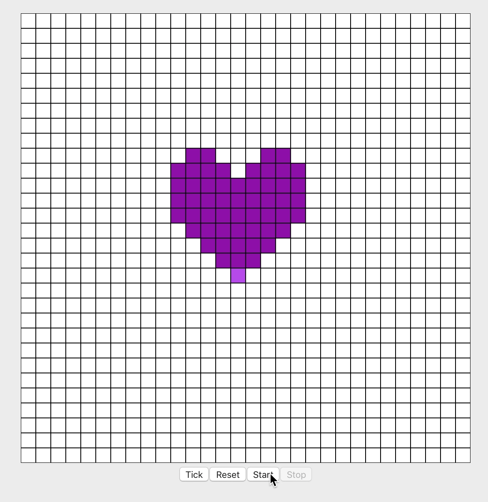

This blog post is a part of a series where I am building Conway’s Game of Life. In [Part 1](/using-react-hooks-to-build-single-responsibility-components), I built an SVG view and discussed how React hooks can help us build single-responsibility components.

If you aren’t familiar with Conway’s Game of Life, it is a zero-player game on a grid that mimics the life cycle of cells. There are four basic rules:

1. Any live cell with fewer than two live neighbors dies, as if by underpopulation.
2. Any live cell with two or three live neighbors lives on to the next generation.
3. Any live cell with more than three live neighbors dies, as if by overpopulation.
4. Any dead cell with exactly three live neighbors becomes a live cell, as if by reproduction.

You should be able to start the game with a “seed”, or an initial set of live cells that can take any shape on the board. Then you should be able to run the game and see the cells change shape with each generation.

For this post, we will be building a custom hook called `useGameOfLife`. You can find the source code [here](https://github.com/beccanelson/react-game-of-life/blob/master/src/hooks/useGameOfLife.ts).

## Testing hooks

In the spirit of TDD, let’s write a failing test. (I am using [React Hooks Testing Library](https://github.com/testing-library/react-hooks-testing-library)).

```js
it(“initially has no living cells”, () => {
  const { result } = renderHook(() => useGameOfLife());
  const { cells } = result.current;
  const livingCells = cells.filter(cell => cell.living === true);

  expect(livingCells.length).toEqual(0);
});
```

This test is… okay. But could it be better? Corey Haines tells us in his book [Understanding the Four Rules of Simple Design](https://leanpub.com/4rulesofsimpledesign) that our function names should mirror our test names. With that in mind, I might refactor my test to look like this.

```js
it(“initially has no living cells”, () => {
  const { result } = renderHook(() => useGameOfLife());

  expect(result.current.hasLivingCells).toBe(false)
});
```

What are the advantages of doing it this way? We are creating a more expressive API and treating this hook _as a user interface_ that is understandable to the humans interacting with it.

## Code as a user interface

Think about it like a public-facing user interface. Under the hood, we might store a date as an ISO timestamp.

```
2020-01-10T13:12:31+00:00
```

However, we wouldn’t put this in a UI, because most users wouldn’t understand it. Instead, we would display something like “Friday, January 10th”.

By providing developers hooks into a component’s state without forcing them to do too much work to understand it, we are treating our code as a user interface that is easy for developers to understand.

Following the same rule, once our first test passes, our second test might look something like this.

```js
it(“can set a living cell”, () => {
  const { result } = renderHook(() => useGameOfLife());

  act(() => {
    result.current.setLivingAt({ x: 1, y: 1 });
  });

  expect(result.current.hasLivingCells).toBe(true);
  expect(result.current.isAliveAt({ x: 1, y: 1 })).toBe(true);
});
```

Notice once again how functions like `setLivingAt` and `isAliveAt` communicate our intent without revealing too much about the internal workings of our function.

So now that we can get and set cells in our hook, we should actually implement some logic. To see the actual logic I am implementing, check out the [source code](https://github.com/beccanelson/react-game-of-life/blob/master/src/hooks/useGameOfLife.ts).

Each time we advance a generation, we are going to loop through each cell and get its state in the next generation based on the state of its neighbors. To do this, let’s add a new function called `isAliveInNextGeneration`. This function counts the number of living neighbors, and uses them to determine whether the cell will live to the next generation based on the current rules.

```js
const isAliveInNextGeneration = React.useCallback(
  function isAliveInNextGeneration(coordinates: Coordinates) {
    const { living } = getCellWithCoordinates(coordinates)
    const numberOfLivingNeighbors = getLivingNeighbors(cell).length

    if (living) {
      return !(numberOfLivingNeighbors < 2 || numberOfLivingNeighbors > 3)
    } else {
      return numberOfLivingNeighbors === 3
    }

    const livingNeighbors = getLivingNeighbors(coordinates)
    return !(livingNeighbors.length < 2 || livingNeighbors.length > 3)
  },
  [getLivingNeighbors]
)
```

We can make sure this works by writing a test for each rule.

```js
test(“a cell with no living neighbors dies in the next generation”, () => {
  const { result } = renderHook(() => useGameOfLife());
  act(() => {
    result.current.setLivingAt({ x: 1, y: 1 });
  });

  expect(
    result.current.isAliveInNextGeneration({ x: 1, y: 1 })
  ).toBe(false);
});
```

We can continue to work like this, adding user-friendly tests and writing functions to pass them. In my example, I also added a `tick()` function to advance the state to the next generation, and a `reset()` function that resets the grid. Here's the completed view component after it is integrated with our custom hook.

```js
const World: React.SFC<WorldProps> = ({
  gridSize = GRID_SIZE,
  cellSize = CELL_SIZE,
}) => {
  const [running, setRunning] = React.useState(false)
  const {
    cells,
    setLivingAt,
    tick,
    reset,
    isAliveInNextGeneration,
    hasLivingCells,
  } = useGameOfLife(gridSize)

  const gridWidth = cellSize * gridSize

  if (running && hasLivingCells) {
    setTimeout(() => {
      tick()
    }, DELAY_MS)
  }

  return (
    <>
      <svg
        width={gridWidth}
        height={gridWidth}
        viewBox={`0 0 ${gridWidth} ${gridWidth}`}
      >
        {cells.map(cell => {
          const { x, y } = cell
          return (
            <Cell
              key={`${x}-${y}`}
              size={cellSize}
              cell={cell}
              onClick={() => {
                setLivingAt({ x, y })
              }}
            />
          )
        })}
      </svg>
      <div>
        <button disabled={running} onClick={() => tick()}>
          Tick
        </button>
        <button disabled={running} onClick={() => reset()}>
          Reset
        </button>
        <button disabled={running} onClick={() => setRunning(true)}>
          Start
        </button>
        <button disabled={!running} onClick={() => setRunning(false)}>
          Stop
        </button>
      </div>
    </>
  )
}
```

Thanks for reading! Let me know on [twitter](https://twitter.com/beccaliz) if you found this helpful!


