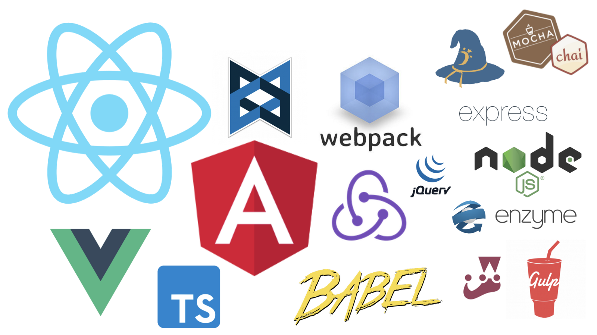

This post is based on talks given at [RVA JavaScript Conf](https://www.youtube.com/watch?v=gD88CtfzkWQ) and Chicago JS Camp.

As a consultant, I have heard a lot about the pain points of JavaScript. It has unpredictable syntax. It has too many libraries, which leave your projects vulnerable to security risks and all sorts of drama like the left-pad debacle of 2016. In fact, I came up with the idea for this talk/post while I was working for one of our client as a de-facto JavaScript therapist. My job was just to sit on a call for an hour once a week, and talk through all these frustrations with a client who was using React and Redux for the first time.

## The Problem

I first learned JavaScript while I was teaching music at a small school in Western Guatemala. In a world where I felt rather lost and unsure of myself and sometimes struggled just to order coffee in Spanish, there was something about learning to program and making my tests turn green that felt really empowering and satisfying. I thought I had everything figured out.

Fast forward a couple of years, I went to Dev Bootcamp, and got a job at 8th Light where I’m working with lots of different clients on lots of different projects. These days, the world of JavaScript looks a little more like this.

For consultants, team-switchers, freelancers, or beginners who don’t quite know where to start, this stack can be especially intimidating.

<iframe src="https://giphy.com/embed/eBCnpuRGBhQGY" width="480" height="409" frameBorder="0" class="giphy-embed" allowFullScreen></iframe>
<a href="https://giphy.com/gifs/mondays-eBCnpuRGBhQGY">via GIPHY</a>

## JavaScript Fatigue is Real

If you’re in this place, I would like to say me too. A huge part of my job every day is finding the right tools for the job, trying to figure out how to use them, and then joining a new project and starting all over again two months later. If you are in this place, I feel your pain.

## The Solution?

When I first started exploring this subject, I’ll be honest. I assumed this was a technical problem. I assumed that there would be one framework or toolset that would win at the end of the day, saving us from all this pain and frustration. I explored web components, web assembly, JavaScript alternatives, and micro architecture.

But the more I dug into this topic, the more I worked on teams that were with people who did this well or didn’t do this so well, the more I became convinced that this isn’t just a technical problem. So let’s talk about some of the values we can cultivate as engineers that help us to survive in this field.

## Agility

When I talk about being agile, I am talking about agile with a lowercase A. I’m not talking about a specific set of project management principles, but a mindset that you can develop over the course of your career.

You see, I got pretty lucky in this respect. At 8th Light, we have an apprenticeship program where you spend the first few months of your job working with mentors and basically learning how to learn. By the end of my apprenticeship, I had built and tested applications in Ruby, Clojure, Java, Swift, JavaScript, and Haskell. Through this experience, I didn’t become a technical expert, especially not in Haskell. But I did come through it with a confidence in my ability to learn. Being confident in your ability to learn, as well as staying open-minded and flexible as new technology comes along helps us to weather the shifting tides of the tech field.

https://twitter.com/sarah_edo/status/1047670631553150976

## Humility

For now, I’m going to define humility as the ability to say “I don’t know”. Because this might sound obvious to you, but the first step to learning something new is admitting that I don’t know it already.

For example, instead of admitting that we just aren’t familiar with Redux, we might say,

- “I can’t get this to work because Redux is just so complicated!”
- “This project would be easier if <insert teammate here> hadn’t added Redux.”
- “Why should I use a tool like Redux if I can just build state management myself?”

Now, I’m not saying that questioning our technology choices is never a good idea. It’s always good to have a healthy amount of skepticism about adopting a new tool or technology that might not be necessary. But more often than not, statements like these are what we reach for to protect ourselves. Saying “I don’t know” feels vulnerable, especially for those of us who are consultants, freelancers, or engineers in less stable employment situations. We want to convince everyone around us that we are the right person for the job, which often involves demonstrating our extensive technical expertise.

But the truth is that in order to be the right person for the job, we have to have humility. We have to know where our weaknesses are so we know where we need to work to improve. As developers, humility should guide our decisions about design, about which libraries to rely on, and which resources to use. With humility, we can admit that perhaps someone else anticipated a problem we just haven’t seen yet, and learn from their experience.

## Courage

In this ever-changing world, it takes courage to keep showing up again and again, and continuing to learn and change and adapt when it’s easier to stick with what you already know. It takes courage to admit the gaps in your knowledge, especially when we feel like the expectation is for us to be the expert. It takes courage to reframe the story from “This is just too hard” to “I haven’t figured this out yet, but I know I will”.

<iframe src="https://giphy.com/embed/VvXg0yjJQgfEQ" width="480" height="268" frameBorder="0" class="giphy-embed" allowFullScreen></iframe>
<a href="https://giphy.com/gifs/mrw-post-rall-VvXg0yjJQgfEQ">via GIPHY</a>

Over the past couple of years, I have grown to love the JavaScript community. This is the community that makes me excited about the future of software engineering — not just because of exciting technologies like React, Typescript, and GraphQL, but also because of its inclusivity and focus on creating accessible user interfaces that solve the real problems that people are facing when using web applications. We may not always know what we’re doing, but at least we’re doing it together.

This post originally appeared on [Medium](https://medium.com/@becca.nelson/javascript-survival-skills-3a73ef385a7f)
